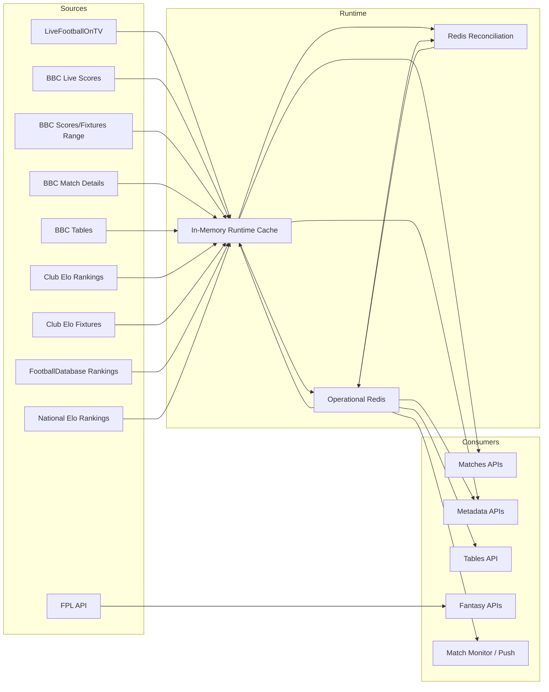
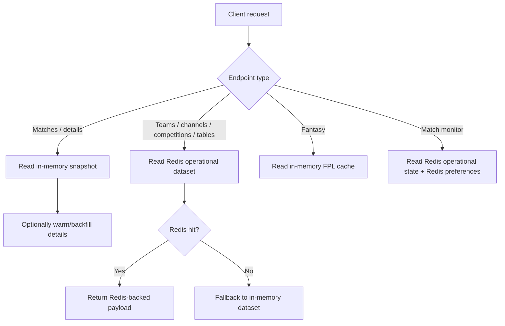
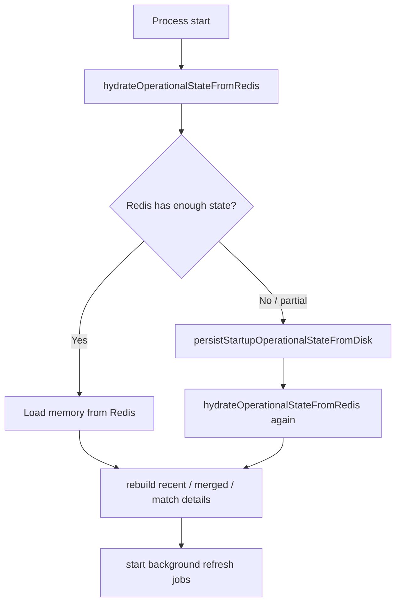
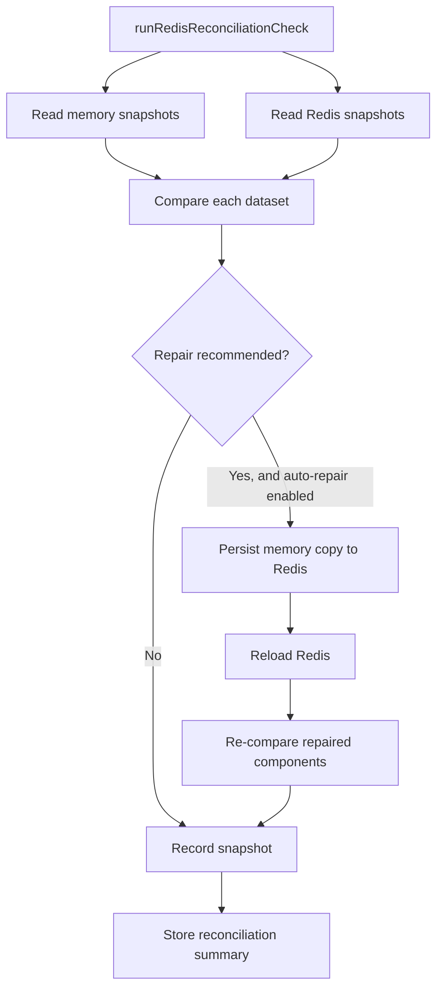

# Architecture Overview

This document describes the current runtime architecture implemented in [`api/server.js`](/Users/mwagstaff/dev/top-scores/api/server.js) and [`api/match_monitor.js`](/Users/mwagstaff/dev/top-scores/api/match_monitor.js).

## High-Level Flow

## 1. External Data Sources

| Source | What it provides | Default pull cadence | Retry behavior | What is updated |
| --- | --- | --- | --- | --- |
| LiveFootballOnTV | Scheduled TV fixtures and channel data | Every 30 minutes | No explicit retry in scheduler | `live_matches`, `recent_matches`, `merged_matches` |
| TheSportsDB Live Scores | Fast live score/status overlay | Every 5 seconds while live matches are active; every 30 seconds when idle | Shared v2 token bucket caps upstream calls below 100/minute | `tsdb_live_matches`, `recent_matches`, `match_details` seeds |
| BBC Scores/Fixtures Range | Broad past/future fixture coverage | Every 1 hour | No explicit retry in scheduler; multi-page fetch with configured concurrency | `bbc_range_matches`, `merged_matches` |
| BBC Match Details | Detailed scorers/cards/lineups/aggregate state for in-progress matches | Every 10 seconds | Per-target failures are logged and skipped; remaining targets continue | `match_details` |
| BBC Tables | League tables plus EPL team list | Tables every 2 minutes, EPL team list every 24 hours | No explicit retry in scheduler | `league_tables`, `premier_league_teams` |
| Club Elo Rankings | Club ranking metadata | Every 12 hours | No explicit retry in scheduler | `club_elo_teams` |
| Club Elo Fixtures | Fixture-level probability metadata | Every 12 hours | No explicit retry in scheduler | enriches `match_details` |
| FootballDatabase Rankings | Club ranking metadata | Every 12 hours | Explicit retry with exponential backoff and adaptive concurrency | `football_database_teams` |
| National Elo Rankings | International ranking metadata | Every 12 hours | Explicit retry with exponential backoff | `national_elo_teams` |
| Fantasy Premier League API | Bootstrap, fixtures, live event data | Bootstrap every 12 hours plus daily 03:00 UK refresh; fixtures every 6 hours; event live every 15 seconds | No explicit scheduler retry; upstream game-update state is surfaced | In-memory fantasy caches only |

### Retry details

- `FootballDatabase` defaults to 4 attempts with backoff `500ms -> 8000ms`, factor `2`, jitter `250ms`.
- `National Elo` defaults to 5 attempts with backoff `400ms -> 5000ms`, factor `2`, jitter `200ms`.
- `BBC Match Details` is resilient in a different way: one failed match-detail fetch does not abort the whole poll cycle.
- Most other feeds are single-attempt per scheduled run. Freshness recovers on the next interval.

## 2. Which Functionality Uses Which Data Sources

### Functional dependency map

| Functionality | Primary datasets | Backing sources | Failure effect |
| --- | --- | --- | --- |
| `/api/v1/matches` | `merged_matches`, `match_details`, `premier_league_teams` | LiveFootballOnTV, BBC range, BBC live, BBC match details, BBC tables | Lists go stale immediately if memory is stale; details become thinner if `match_details` lags |
| `/api/v1/matches/:matchId` and `/api/v1/bbc/details` | `match_details` with in-memory fallback payload | BBC live, BBC match details, Club Elo fixtures | Detailed scorers/cards/lineups/aggregate data can be stale or missing |
| `/api/v1/matches/states` | `match_details` | BBC live, BBC match details | Can still hydrate misses from Redis, but freshness depends on detail polling |
| `/api/v1/competitions` and `/api/v1/channels` | `merged_matches` | LiveFootballOnTV + BBC range/live merged output | Lists become stale if merged cache or Redis copy drifts |
| `/api/v1/teams*` | `merged_matches`, `club_elo_teams`, `football_database_teams`, `national_elo_teams`, `premier_league_teams` | Match feeds + ranking feeds + BBC tables | Team metadata and ranking overlays become stale; endpoint still works from older snapshots if available |
| `/api/v1/tables*` | `league_tables` | BBC tables | Tables become stale or unavailable if both Redis and memory copies are bad |
| Fantasy endpoints under `/api/v1/fantasy/*` | FPL bootstrap, fixtures, event live caches | FPL API | Fantasy gameweek/bootstrap/score/recommendation features return stale data or `503` when caches are missing |
| Match monitor, push notifications, Live Activities | Redis `merged_matches`, `recent_matches`, `match_details`, Redis user preferences, BBC live text | Operational Redis + BBC match details/live text | Notification decisions and live activities degrade or stop if Redis operational state or user preferences are unavailable |

### “What wouldn’t work” by source failure

| Source failure | User-visible impact |
| --- | --- |
| LiveFootballOnTV | TV channel listings and some fixture coverage degrade |
| BBC Live Scores | Live scores/status updates lag; recent cache and initial detail seeding degrade |
| BBC Range | Broad fixture/result coverage degrades; new fixtures may not appear |
| BBC Match Details | Rich match detail pages degrade; monitor/event decisions lose detail |
| BBC Tables | `/api/v1/tables` and EPL-team filters go stale |
| Club Elo Rankings | Club Elo overlays in team/ranking responses go stale |
| Club Elo Fixtures | Match-detail probability enrichment stops updating, but core fixture/result APIs still work |
| FootballDatabase | FootballDatabase-based ranking overlays go stale |
| National Elo | International ranking overlays go stale |
| FPL API | Fantasy endpoints return stale data or `503`; no effect on non-fantasy operational Redis flow |

## 3. Redis vs In-Memory Server Cache

### Source of truth by area

| Area | Primary runtime authority | Redis role |
| --- | --- | --- |
| Matches list and match-detail responses | In-memory cache | Bootstrap/fallback only for some detail paths |
| Competitions, channels, teams, tables | Redis-preferred, memory fallback | Main read path for metadata/table endpoints |
| Match monitor and user preferences | Redis | Required operational dependency |
| Fantasy/FPL | In-memory cache | Not part of operational Redis snapshot |

### In-memory datasets

- `cachedMatches`
- `cachedBbcMatches`
- `cachedBbcRangeMatches`
- `cachedMergedMatches`
- `cachedRecentMatches`
- `cachedLeagueTables`
- `cachedPremierLeagueTeams`
- `cachedClubEloTeams`
- `cachedFootballDatabaseTeams`
- `cachedNationalEloTeams`
- `matchDetailsById`
- FPL caches such as `cachedFantasyBootstrap`, `cachedFantasyFixtures`, `cachedFantasyEventLive`

### Redis-backed operational datasets

- `live_matches`
- `bbc_live_matches`
- `bbc_range_matches`
- `recent_matches`
- `merged_matches`
- `premier_league_teams`
- `league_tables`
- `club_elo_teams`
- `football_database_teams`
- `national_elo_teams`
- `missing_team_logos`
- `cache_state`
- `match_details`

### Read semantics

## 4. Sync and Reconciliation: In-Memory Cache to Redis

### Normal write path

1. A scheduled updater fetches upstream data.
2. The updater writes the fresh payload into the in-memory cache first.
3. The updater persists the corresponding operational dataset to Redis via `persistOperationalDatasetSafe(...)` or `persistOperationalMatchDetailsSafe(...)`.
4. Derived caches are rebuilt as needed, mainly `recent_matches`, `merged_matches`, and `match_details`.

This means memory is the live runtime layer, while Redis is the durable operational snapshot.

### Bootstrap and hydration

### Reconciliation process

Default schedule: every 5 minutes.

Compared stores:

- every operational array dataset listed above
- `match_details`

Comparison signals:

- payload hash
- item count
- `updated_at`
- sample diffs for arrays/objects

Possible statuses include:

- `in_sync`
- `empty`
- `memory_missing`
- `redis_missing`
- `meta_out_of_sync`
- `redis_stale`
- `redis_newer`
- `payload_mismatch`

### Auto-repair behavior

If auto-repair is enabled, reconciliation writes memory back to Redis when Redis is:

- missing
- older than memory
- only metadata-stale

It does not overwrite Redis when Redis is detected as newer.

### Reconciliation flow

## Admin Status Surface

New admin pages:

- `/admin/status`
- `/admin/status/:componentId`

New admin APIs:

- `/api/v1/admin/status/overview`
- `/api/v1/admin/status/components/:componentId`

What the status UI shows:

- interactive architecture flow diagram
- component health at a glance
- per-component detail pages
- last update times
- recent runtime errors
- reconciliation state
- Redis connectivity
- feed/dataset counts

Important scope note:

- The fantasy/FPL caches are shown in admin status, but they are not part of the Redis operational reconciliation loop.

## Player Portrait Source

Player portraits use the existing canonical `cutout_url` response field, with the provider selected by `PLAYER_IMAGE_SOURCE`:

- `bsd` (default) emits the public, long-cache BSD URL `https://sports.bzzoiro.com/img/player/{bsd_player_id}/`.
- `tsdb` preserves the previous TheSportsDB portrait path as a rollback option.

BSD match projections retain `bsd_player_id` for portrait construction while `id_player` remains the mapped TSDB identifier used by the existing player-biography endpoint. When no confident mapping exists, the BSD portrait is still returned but `id_player` is null so clients cannot query TSDB with a BSD identifier.

The web and iOS portrait loaders treat decoded 1×1 responses as missing images and fall back to player initials. This is required because the BSD image proxy can return a successful 1×1 missing-image response rather than an HTTP error.
