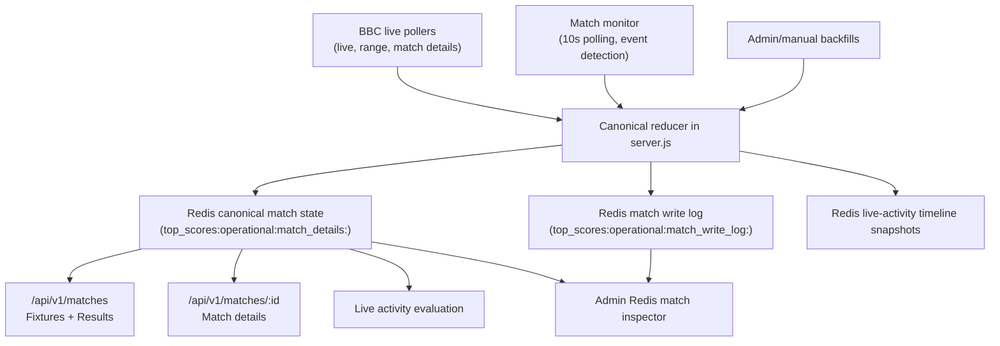

# Redis Canonical Match State

This document describes the canonical match-state flow after the Redis cutover.

## Goals

- Use one Redis-backed canonical match-state record per BBC match ID.
- Ensure Fixtures, Results, live activity, and admin tooling all read the same settled scoreline.
- Keep a short-lived per-match Redis audit log for state writes and corrections.
- Apply scoreline corrections centrally, especially:
  - VAR-disallowed goals
  - transient penalty-shootout tallies vs settled penalty results
  - stable finished-state retention

## Flow

## Write Model

All state writers submit match observations into the same reducer.

The reducer:

1. Normalizes the observation into the canonical match-state shape.
2. Merges it with the current canonical record by match ID.
3. Applies stable-state corrections:
   - resolved penalty result beats transient `PENS`
   - confirmed VAR-disallowed goals can reduce the numeric score
   - finished state is preserved once confirmed
4. Writes the updated canonical record back to Redis.
5. Appends a short-lived audit-log entry for any meaningful state change.

## Read Model

The app-facing views now read the canonical Redis-backed state:

- `/api/v1/matches` materializes fixture/result rows from canonical match-state records.
- `/api/v1/matches/:id` reads canonical state by match ID.
- live activity evaluation builds its match list from canonical state, not the old merged/recent dataset overlay path.
- the iOS Fixtures view no longer overlays `/api/v1/bbc/live` on top of `/api/v1/matches`.

## Redis Keys

- Canonical match state:
  - `top_scores:operational:match_details:<matchId>`
- Canonical match-state index:
  - `top_scores:operational:match_details:index`
- Canonical match-state meta:
  - `top_scores:operational:match_details:meta`
- Match write audit log:
  - `top_scores:operational:match_write_log:<matchId>`

## Audit Log Retention

- Match write logs are intentionally short-lived.
- Current retention target: 6 days.
- Each match keeps a bounded rolling list of recent write entries for troubleshooting.

## Troubleshooting

If a scoreline looks wrong:

1. Open `/admin/redis/matches`.
2. Find the match by scoreline or match ID.
3. Open the match detail view.
4. Check the canonical payload.
5. Compare the write-log sequence to see which writer changed the score and when.

## Notes

- Redis is the canonical operational store.
- In-memory state is only a working mirror/cache and should never be treated as a competing source of truth for user-facing scorelines.
- If a future data source is added, it must write through the same reducer rather than patching consumer-specific overlays.
